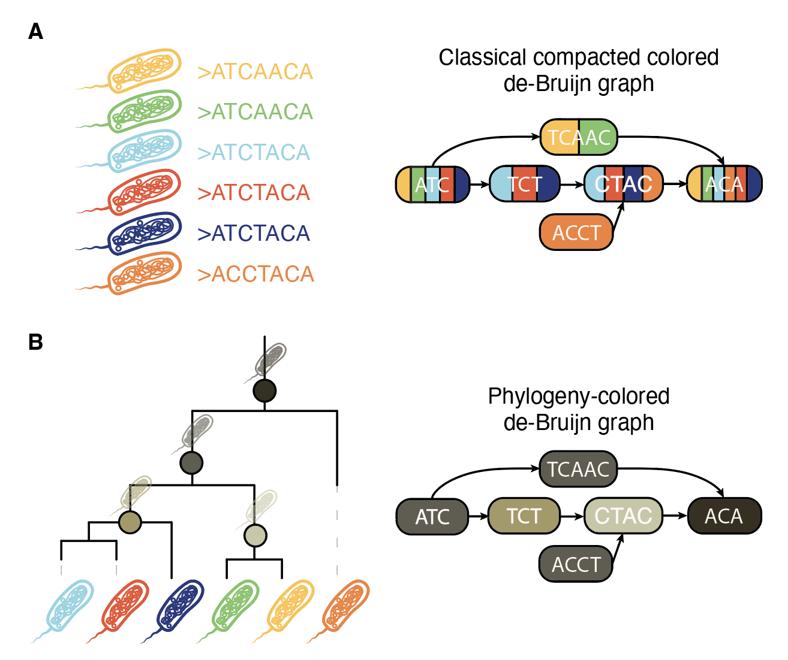
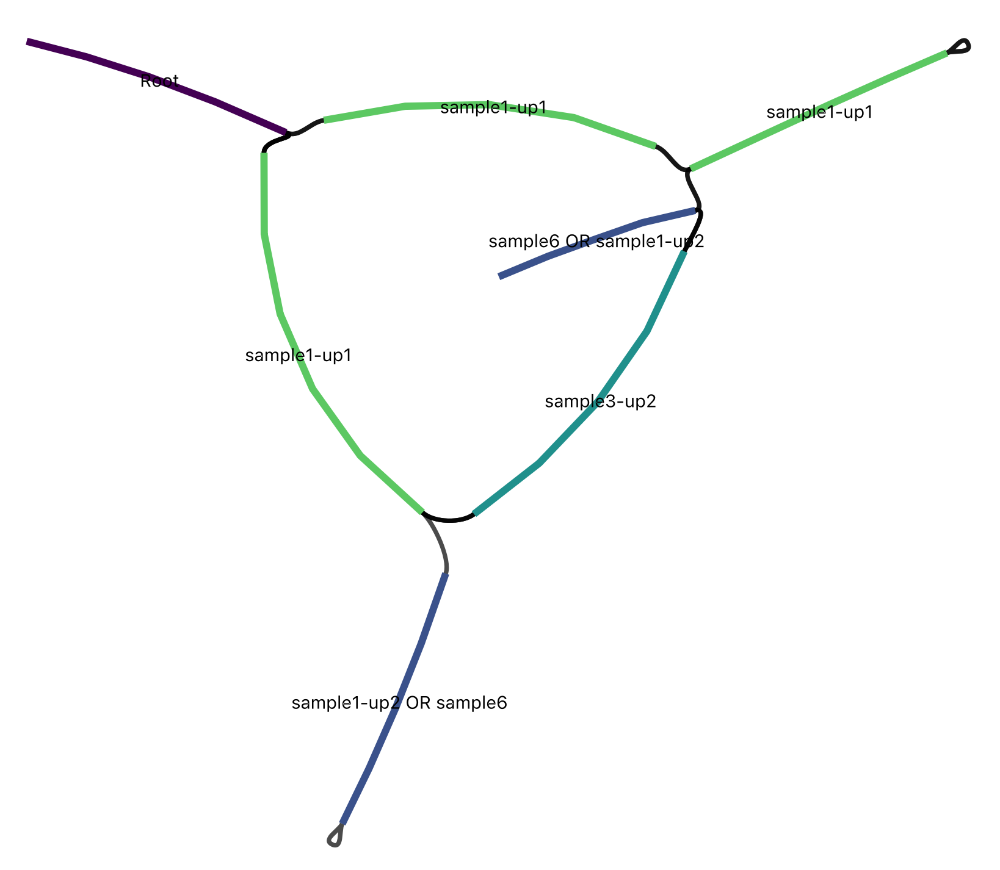

# Phylogeny-Colored de Bruijn Graphs

Workflow for constructing phylogeny-colored compacted de Bruijn graphs (pcDBGs). 
The pipeline couples classical colored DBG construction (via Cuttlefish) with 
parsimony analysis on a provided phylogeny to recolor the DBG based on the 
parsimonious presence/absence of individual unitigs.

<p align="center">
  
</p>

<p align="center">
  <sub><b>A.</b> In a classical compacted colored de Bruijn graph, each unitig carries one
  color per sample it occurs in. <b>B.</b> In a phylogeny-colored de Bruijn graph, each unitig
  instead carries the internal node of the phylogeny that most parsimoniously explains its
  presence/absence pattern.</sub>
</p>

## Contents

- [Overview](#overview)
- [Key Features](#key-features)
- [Requirements](#requirements)
- [Installation](#installation)
- [Preparing Inputs](#preparing-inputs)
- [Configuration](#configuration)
- [Running the Workflow](#running-the-workflow)
- [Outputs](#outputs)
- [Phylogenetic Analyses](#phylogenetic-analyses)
- [Parsimony Modes](#parsimony-modes)
- [Application Roadmap](#application-roadmap)
- [Troubleshooting](#troubleshooting)
- [Citation](#citation)
- [Issues](#issues)
- [Changelog](#changelog)
- [License](#license)
- [Contacts](#contacts)
- [Acknowledgements](#acknowledgements)

## Overview

pcDBG accepts fasta sequences together with a matching Newick tree. For each 
batch (fasta sequence pathlist & newick tree) the Snakemake workflow:

1. Builds a compacted colored DBG with Cuttlefish.
2. Derives unitig presence/absence matrices and collapses redundant colour
   vectors.
3. Runs parsimony (Fitch by default, optional branch-length-weighted Sankoff)
   across the supplied phylogeny to map unitigs onto internal nodes.
4. Produces a phylogeny-coloured GFA, compression metrics comparing the 
   original Cuttlefish colours with the lossy pcDBG coloring, and optionally
   more!

## Key Features

- Snakemake-driven, reproducible DAG with documented Makefile entry points.
- Supports both Fitch and Sankoff parsimony models, with Sankoff penalties
  configurable via `config.yaml`.
- Generates minimal-cut decompositions and SQLite annotations for graph
  post-processing.
- Emits compression diagnostics
  (`intermediate/metrics/*_compression_<mode>_k<k>.tsv`) summarising colour
  reduction relative to Cuttlefish.
- Optional BubbleGun analysis for (super)bubbles and colored bubble calls.

## Requirements

- GNU Make
- Python ≥ 3.9
- Snakemake ≥ 9.0
- Conda or Mamba is recommended so Snakemake can create the per-rule
  environments automatically

The Snakemake environments under `workflow/envs/` install all other tools on
demand, notably:

- [Cuttlefish](https://github.com/COMBINE-lab/cuttlefish)
- [ETE4](http://etetoolkit.org/)
- [Pandas](https://pandas.pydata.org/)
- [BubbleGun](https://github.com/fawaz-dabbaghieh/bubble_gun)

To provision the environments ahead of time:

```bash
make conda
```

## Installation

```bash
git clone https://github.com/aryakaul/phylogeny-colored-dbg.git
cd phylogeny-colored-dbg
```

Alternatively, download the archive:

```bash
mkdir phylogeny-colored-dbg
cd phylogeny-colored-dbg
curl -L https://github.com/aryakaul/phylogeny-colored-dbg/tarball/main \
  | tar xvf - --strip-components=1
```

## Preparing Inputs

Each batch corresponds to a manifest (`input/{batch}.txt`) listing assembly
paths and a Newick tree (`input/{batch}.nwk`) whose leaf names match the FASTA
basenames (minus suffix).

- Manifests may use absolute paths (recommended) or paths relative to the
  repository root.
- Supported genome file suffixes: `.fa`, `.fna`, `.fasta`, `.ffa` (optionally
  gzip-compressed).

Example manifest:

```bash
find /data/genomes -name '*.fa' > input/genomes.txt
```

## Configuration

All configuration lives in [`config.yaml`](config.yaml). Important fields:

- `input_dir`, `intermediate_dir`, `output_dir` — rooted directories for each
  stage. The defaults expect manifests in `input/`, intermediates in
  `intermediate/`, and final products in `output/`.
- `kmer_length` — k-mer size passed to Cuttlefish.
- `tmp_dir` — scratch space for Cuttlefish; defaults to `tmp/` within the repo
  if unspecified.
- `parsimony.mode` — `fitch` (default) or `sankoff`.
- `parsimony.sankoff_branch_penalty` — optional numeric multiplier for Sankoff
  transitions; omit to auto-scale from mean branch lengths.
- `produce_colored_deletions` — toggle BubbleGun and deletion-finding rules.
- `produce_breakpoints` — toggle concordance-breakpoint and boundary-severity
  analyses.
- `produce_coherence_decay` — toggle the evolutionary-persistence analysis
  (also accepted as `produce_persistence`).
- `produce_stratification` — toggle the evolutionary-stratification analysis.
- `produce_minimalcuts_colors` — emit per-unitig minimal-cut colour assignments.
- `use_conda` — if `False`, Snakemake assumes all tool dependencies are already
  available.

Any change to `config.yaml` automatically retriggers relevant workflow steps
thanks to the configured Snakemake rerun triggers.

## Running the Workflow

Key Makefile targets:

```bash
make all        # Execute the full Snakemake DAG on all batches
make test       # Run the workflow on bundled test data (lightweight sanity check)
make clean      # Remove generated outputs (keeps environments)
make cleanall   # Remove outputs and intermediates
make help       # Show all available targets
```

During execution Snakemake maintains intermediates under `intermediate/` and
final under `output/`. If you disable Conda, ensure the toolchain versions
satisfy the `workflow/envs/` specifications.

## Outputs

For each batch `{batch}` and parsimony label `{mode_label}` (e.g., `fitch`,
`sankoff-auto`, `sankoff-0p5`):

- `output/{batch}/phylogenycolored_dbg_k{k}.gfa` — final phylogeny-coloured GFA.
- `intermediate/cuttlefish/{batch}/{batch}_compcoloreddbg_k{k}.gfa1` — raw
  Cuttlefish graph.
- `intermediate/cuttlefish/{batch}_unitigcolors_k{k}.tsv` — unitig presence/
  absence matrix (samples × unitigs).
- `intermediate/cuttlefish/{batch}_uqcolors_k{k}.tsv` — deduplicated colour
  vectors used for parsimony.
- `intermediate/minimalcuts/{batch}_minimalcuts_{mode_label}_k{k}` — minimal
  cuts per unique colour set (one line per set, `OR` when multiple solutions).
- `intermediate/minimalcuts/{batch}_unitig2cuts_{mode_label}_k{k}` — mapping
  from unitig IDs to assigned minimal cut solutions.
- `intermediate/sqldb/{batch}_k{k}.sqldb` — SQLite database joining unitigs,
  sequences, and colour metadata.
- `intermediate/metrics/{batch}_compression_{mode_label}_k{k}.tsv` — compression
  metrics comparing Cuttlefish unique colour counts with the pcDBG labels.
- Optional BubbleGun outputs under `intermediate/bubblegun/` when enabled.
- Analysis outputs under `output/breakpoints/`, `output/severity/`,
  `output/persistence/`, and `output/stratification/` — see
  [Phylogenetic Analyses](#phylogenetic-analyses).

<p align="center">
  
</p>

<p align="center">
  <sub>The bundled test dataset rendered in <a href="https://rrwick.github.io/Bandage/">Bandage</a>,
  with unitigs colored by their assigned internal node. Labels such as
  <code>sample1-up2 OR sample6</code> mark unitigs whose presence/absence pattern has more than
  one equally parsimonious explanation.</sub>
</p>

The compression metrics TSV contains four numeric rows:

| metric                     | description                                                     |
|--------------------------- |-----------------------------------------------------------------|
| `cuttlefish_unique_colors` | Number of distinct colour vectors before parsimony compression. |
| `pcdbg_unique_colors`      | Distinct internal-node colour labels assigned by pcDBG.         |
| `absolute_difference`      | `cuttlefish_unique_colors - pcdbg_unique_colors`.               |
| `pcdbg_to_cuttlefish_ratio` | Fraction of colours retained (ratio in `[0,1]`).              |


## Phylogenetic Analyses

Beyond the coloured graph itself, the workflow computes four analyses over the
parsimony-assigned colours. Each is toggled in [`config.yaml`](config.yaml) and
writes into its own directory under `output/`. Paths below use the batch name,
k-mer length, and parsimony label (e.g. `fitch`).

- **Concordance breakpoints** (`produce_breakpoints`) — binary concordance
  breakpoint detection: locates edges where adjacent unitigs disagree about
  their inferred phylogenetic origin.
  `output/breakpoints/{batch}_k{k}_{mode_label}_breakpoints.tsv`, with summary
  statistics in `..._breakpoint_summary.tsv`.
- **Boundary severity** (`produce_breakpoints`) — phylogenetic discordance at
  graph edges, scoring how severe each boundary is rather than treating every
  breakpoint as equivalent.
  `output/severity/{batch}_k{k}_{mode_label}_boundary_severity.tsv`, with an
  accompanying `.svg`.
- **Evolutionary persistence** (`produce_coherence_decay`) — coherence decay
  along graph walks: how far a colour assignment persists before a walk crosses
  into a different inferred origin.
  `output/persistence/{batch}_k{k}_{mode_label}_evolutionary_persistence.tsv`,
  a per-seed breakdown in `..._per_seed_persistence.tsv`, and an `.svg`.
- **Evolutionary stratification** (`produce_stratification`) — depth filtration
  of pangenome structure, partitioning unitigs by the depth of the internal node
  they are assigned to.
  `output/stratification/{batch}_k{k}_{mode_label}_evolutionary_stratification.tsv`,
  with an accompanying `.svg`.

## Parsimony Modes

- **Fitch (default):** unit-cost transitions for binary presence/absence,
  suitable when branch lengths are unavailable or unreliable.
- **Sankoff:** weighted by branch lengths with an optional penalty multiplier
  from `config.yaml`. If no penalty is provided the workflow scales one from the
  mean branch length.

Outputs incorporate the parsimony label in their filenames so switching modes
automatically triggers distinct Snakemake targets.

## Troubleshooting

- `make test` runs the pipeline on a lightweight dataset in `.test`; use it to check
  installation
- Snakemake reruns steps when inputs, parameters, code, or config change; no
  manual `--force` is required for standard edits.
- Inspect `.snakemake/log/` for per-rule logs if a job fails.
- Ensure manifest filenames match the tree leaves; mismatches surface as early
  validation errors in `workflow/rules/init.smk`.

## Citation

*In preparation.*

## Issues

Report problems or feature requests via
[GitHub issues](https://github.com/aryakaul/phylogeny-colored-dbg/issues).

## Changelog

See the [commit history](https://github.com/aryakaul/phylogeny-colored-dbg/commits/main).

## License

[GPL-3.0](LICENSE.md)

## Contacts

- [Arya Kaul](https://arya.casa) — arya_kaul@g.harvard.edu
- [Karel Brinda](http://karel-brinda.github.io) — karel.brinda@inria.fr

## Acknowledgements

Project structure, documentation style, and several workflow concepts took
inspiration from [Miniphy](https://github.com/karel-brinda/Miniphy). Check
it out!
